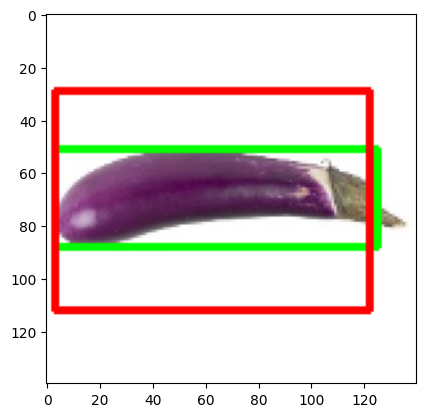

# Single Object Localization with PyTorch

A computer vision project that uses a pre-trained EfficientNet-B0 to predict bounding box coordinates $(x_{min}, y_{min}, x_{max}, y_{max})$ for single objects in images. It uses PyTorch, and `timm` (PyTorch Image Models) to load the pre-trained EfficientNet-B0 model.

## Architecture

-   **Backbone:** EfficientNet-B0 (pre-trained).
-   **Last layer:** The final classification layer is replaced with a regression head that outputs 4 continuous values representing the bounding box.

## Training Details

- **Dataset:** Uses an **Object Localization Dataset** containing various images with annotated bounding boxes.  
- **Augmentations:** Random rotations and flips are applied to the bounding boxes and images simultaneously using `Albumentations`.
- **Optimization:** Trained using the Adam optimizer and Mean Squared Error (MSE) loss.

## Result

**Output after training for 40 epochs. Output bounding box in red, ground truth in green**
